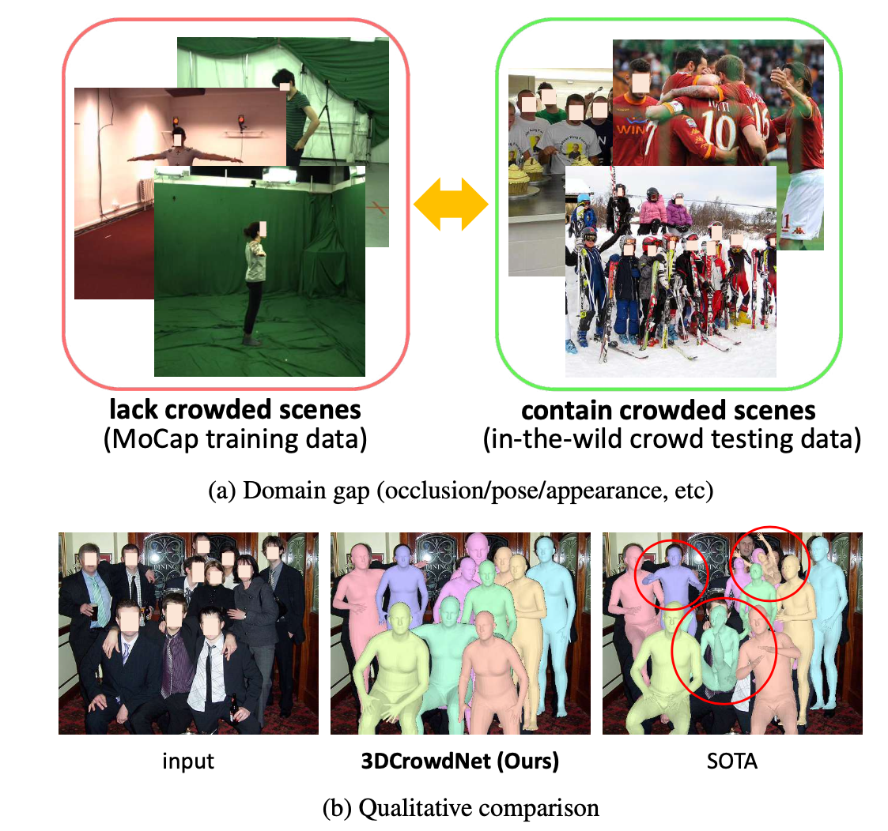
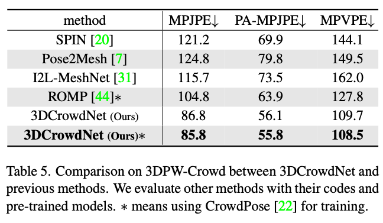
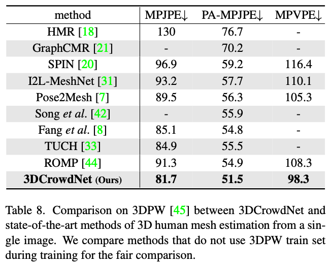

# Learning to Estimate Robust 3D Human Mesh from In-the-Wild Crowded Scenes / 3DCrowdNet



## News
:muscle: 3DCrowdNet achieves the **state-of-the-art accuracy** on **[3DPW](https://virtualhumans.mpi-inf.mpg.de/3DPW/)** (3D POSES IN THE WILD DATASET)!
:muscle: We improved **PA-MPJPE** to **51.1mm** and **MPVPE** to **97.6mm** using a ResNet 50 backbone!

## Introduction  
This repo is the official **[PyTorch](https://pytorch.org)** implementation of **[Learning to Estimate Robust 3D Human Mesh from In-the-Wild Crowded Scenes (CVPR 2022)](https://arxiv.org/abs/2104.07300)**. 


## Installation
We recommend you to use an [Anaconda](https://www.anaconda.com/) virtual environment. Install PyTorch >=1.6.0 and Python >= 3.7.3. 
Then, run `sh requirements.sh`. You should slightly change `torchgeometry` kernel code following [here](https://github.com/mks0601/I2L-MeshNet_RELEASE/issues/6#issuecomment-675152527).
  
  
## Quick demo  
* Download the pre-trained 3DCrowdNet checkpoint from [here](https://drive.google.com/drive/folders/1YYQHbtxvdljqZNo8CIyFOmZ5yXuwtEhm?usp=sharing) and place it under `${ROOT}/demo/`. 
* Download demo inputs from [here](https://drive.google.com/drive/folders/1YYQHbtxvdljqZNo8CIyFOmZ5yXuwtEhm?usp=sharing) and place them under `${ROOT}/demo/input` (just unzip the demo_input.zip).
* Make `${ROOT}/demo/output` directory.
* Get SMPL layers and VPoser according to [this](./assets/directory.md#pytorch-smpl-layer-and-vposer).
* Run `python demo.py --gpu 0`. You can change the input image with `--img_idx {img number}`.
* A mesh obj, a rendered mesh image, and an input 2d pose are saved under  `${ROOT}/demo/`.
* The demo images and 2D poses are from [CrowdPose](https://github.com/Jeff-sjtu/CrowdPose) and [HigherHRNet](https://github.com/HRNet/HigherHRNet-Human-Pose-Estimation) respectively.
* The depth order is not estimated. You can manually change it.


## Results
:sunny: Refer to the paper for diverse qualitative results!  





## Directory
Refer to [here](./assets/directory.md).


## Running 3DCrowdNet
First finish the directory setting.
Then, refer to [here](./assets/running.md) to train and test 3DCrowdNet.


## Reference  
```  
@InProceedings{choi2022learning,  
author = {Choi, Hongsuk and Moon, Gyeongsik and Park, JoonKyu and Lee, Kyoung Mu},  
title = {Learning to Estimate Robust 3D Human Mesh from In-the-Wild Crowded Scenes},  
booktitle = {Conference on Computer Vision and Pattern Recognition (CVPR)}
year = {2022}  
}  
```


